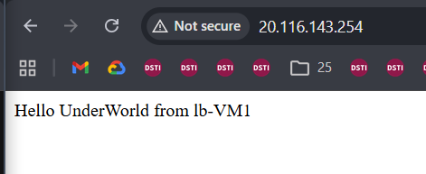
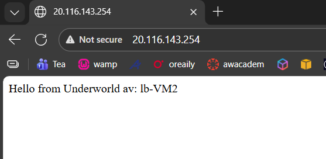

# Azure High-Availability Web Architecture
### Public Load Balancer & Windows Server 2025 Cluster

## Project Overview
This project demonstrates a production-ready, highly available infrastructure in **Azure**. I deployed a **Standard Public Load Balancer** to manage and distribute incoming web traffic across two **Windows Server 2025** virtual machines located in separate availability zones within the **Canada Central** region.

## Technical Architecture
* **Virtual Network (VNet):** `10.0.0.0/16` address space with a backend subnet.
* **Public Load Balancer:** Standard SKU with a static frontend IP for reliable access.
* **NAT Gateway:** Configured to provide consistent outbound internet connectivity for the backend VMs.
* **Azure Bastion:** Utilized for secure, browser-based RDP management without exposing VMs to the public internet via Port 3389.
* **Availability Zones:** VMs were placed in **Zone 1** and **Zone 2** to ensure resilience against data center failures.

## Infrastructure Specifications (JSON)
The underlying configuration of this deployment is captured in the `/infrastructure` directory. Key data points extracted from the Azure Resource Manager (ARM) include:
* **Frontend IP:** `20.116.143.254`
* **VM Size:** `Standard_B2ts_v2`
* **OS Image:** `Windows Server 2025 Datacenter (Azure Edition)`
* **Location:** `canadacentral`

## Deployment & Configuration
### 1. Web Server Installation
After establishing connectivity via **Azure Bastion**, I used PowerShell to automate the IIS setup and create a unique landing page for each node to track traffic distribution.

### Traffic routed to VM1:




### Traffic routed to VM2:




```powershell
# Corrected syntax for IIS Installation
Install-WindowsFeature -Name Web-Server -IncludeManagementTools

# Create unique landing page
Remove-Item C:\\inetpub\\wwwroot\\iisstart.htm
Add-Content -Path "C:\\inetpub\\wwwroot\\iisstart.htm" -Value $("Hello Underworld from " + $env:computername)
